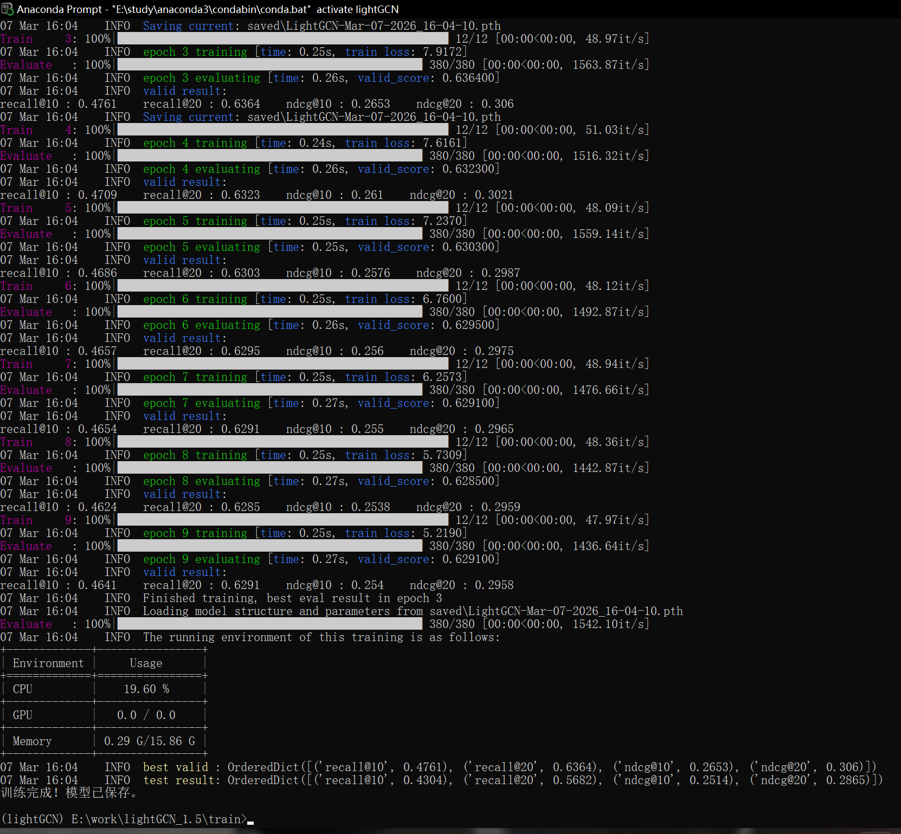
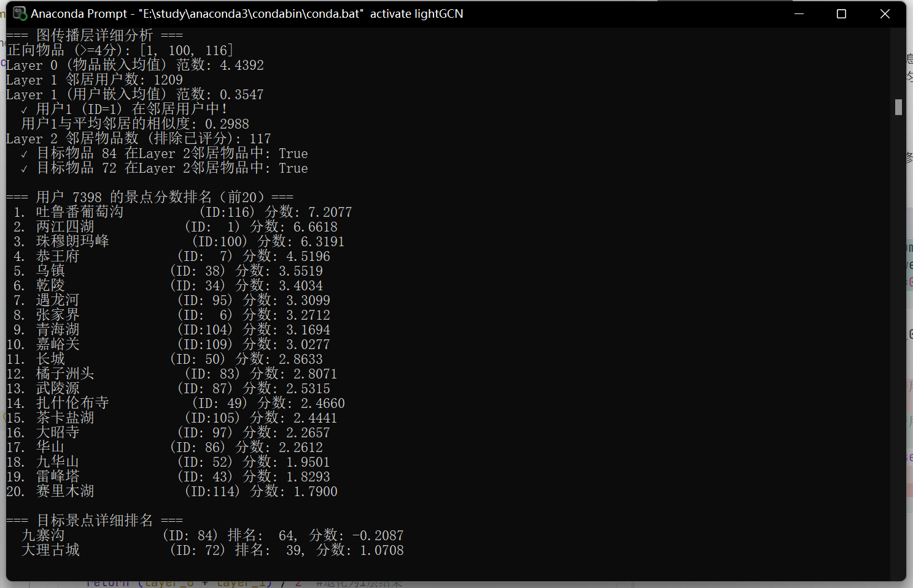
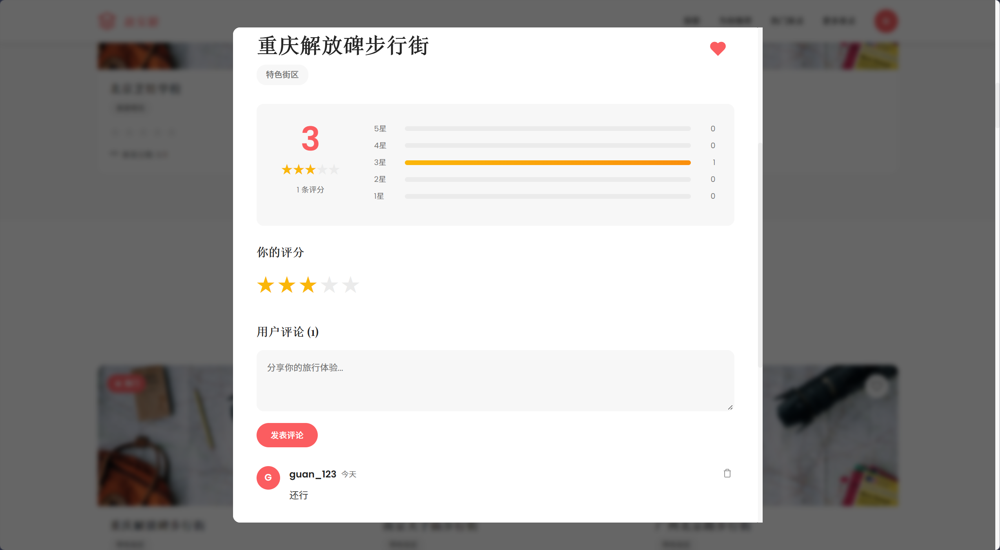
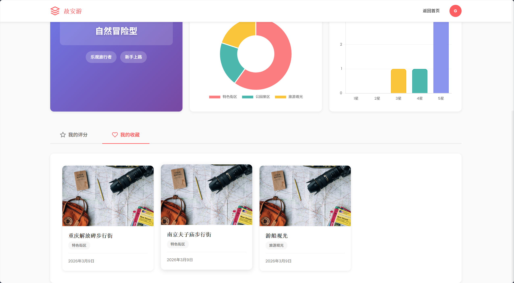

# 故安游 - 基于LightGCN的旅游推荐系统

[](https://www.python.org/)
[](https://pytorch.org/)
[](https://vuejs.org/)
[](https://flask.palletsprojects.com/)
[](LICENSE)

> 一个基于图神经网络(LightGCN)的智能旅游推荐系统，支持新老用户的个性化推荐，提供完整的Web界面和RESTful API。

## ✨ 项目特色

- **🧠 先进算法**: 基于LightGCN图神经网络，利用图卷积捕获用户-物品高阶交互信息
- **🆕 冷启动支持**: 针对新用户设计多级推荐策略（热门推荐 → 实时图传播 → 模型推荐）
- **⚡ 实时推荐**: 支持新用户评分后的实时图传播更新，即时获得个性化推荐
- **🌐 完整系统**: 包含Vue.js前端 + Flask后端 + 推荐引擎的完整架构
- **📊 可视化展示**: 美观的用户界面，支持评分、收藏、个人主页等功能

## 🚀 快速开始

### 环境要求

- Python 3.8+
- PyTorch 1.9+
- CUDA (可选，用于GPU加速)

### 1. 安装依赖

```bash
pip install -r requirements.txt
```

主要依赖：
- `torch` - 深度学习框架
- `recbole` - 推荐系统框架
- `flask` / `flask-cors` / `flask-sqlalchemy` - 后端服务
- `pandas` / `numpy` - 数据处理
- `streamlit` - 演示界面

### 2. 启动后端服务

```bash
# 进入后端目录
cd src/backend

# 启动Flask服务
python app.py
```

后端服务默认运行在 `http://localhost:5001`

### 3. 启动前端

直接打开 `src/frontend/index.html` 文件，或使用本地服务器：

```bash
cd src/frontend
python -m http.server 8080
```

访问 `http://localhost:8080` 即可使用系统。

### 4. 一键启动

直接运行`start.bat` 文件可直接启动前后端

## 🎯 使用指南

### 网页端使用

1. **注册/登录**: 首次使用需要创建用户账号
2. **浏览景点**: 在"探索"页面查看所有旅游景点
3. **评分收藏**: 对喜欢的景点进行评分（1-5星）
4. **获取推荐**: 系统会根据评分自动推荐相似景点
5. **查看个人主页**: 管理个人信息和收藏列表

## 🧪 模型训练

### 使用RecBole训练

```bash
cd train
python train.py
```

训练配置可在 `lightgcn_config.yaml` 中修改：

```yaml
# 关键参数
embedding_size: 64          # 嵌入向量维度
n_layers: 2                 # 图卷积层数
learning_rate: 0.001        # 学习率
epochs: 300                 # 训练轮数
```


### 模型测试结果



### 前端示例
主页推荐

景点评价

用户个人空间


### 参考文献

- [RecBole](https://github.com/RUCAIBox/RecBole) - 推荐系统框架
- [Yelp Dataset](https://www.yelp.com/dataset) - 开源数据集


